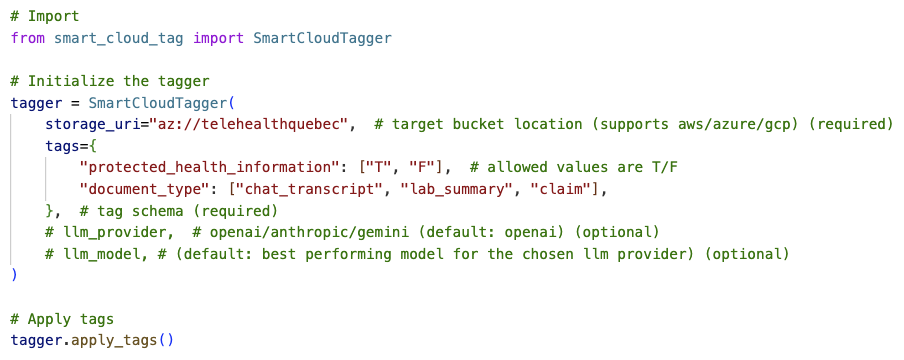

# Smart Cloud

A Python package: a multi-cloud tagging solution that automatically applies semantic tags/metadata to objects in batch across cloud providers using LLMs (GenAI).It provides end-to-end solution that seamlessly reads content, predicts tags, and applies them, enabling one-command automation.

## Technologies
Python, LLMs (OpenAI, Gemini, Anthropic), Azure Blob Storage, Google Cloud Storage, AWS S3

## Architecture Digram

## Example

